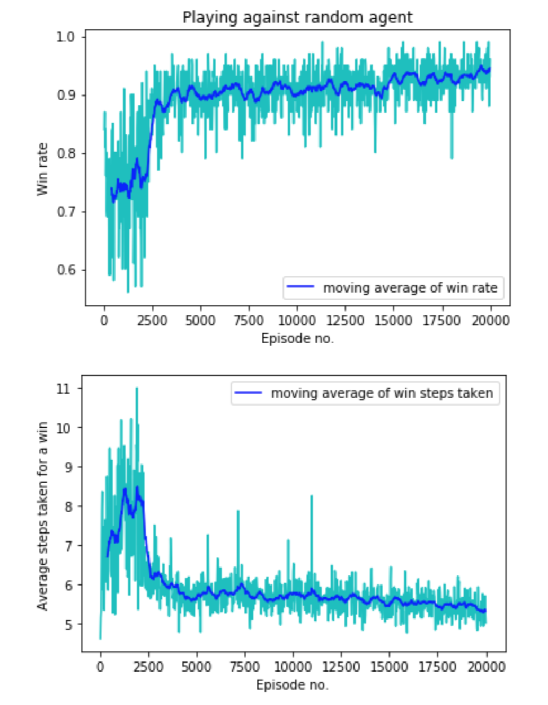

# Connect - 4
Unlike supervised learning, reinforcement learning takes no target values as a part of training data. It relies solely on the interaction between agents and its environment and under the markov decision process assumption, it is hoped it can find its way to finish the task. In essence, it is not told how the task should be done but rather, figure out what to do itself by learning from sampled transitions.  

# Things inside the notebook
* Connect - 4 game environment.
* Demonstration of using deep convolutional network as a function approximator of state action values.
* Application of Bellman optimality equation in training deep-Q network.
* Importance of sampling with experience replay and comparison to AlphaGo Zero self-play algorithm.
* Agent learning from scratch to eventually winning connect - 4 with no human designed rules.
* Training procedure and demo of agent playing the game.

# Results
The agent has been achieved effective and stable performance after 20000 epochs and demonstrated high win rate and decreasing steps needed for a win. This trained policy can be used by reloading the pytorch model ```policy_net``` which expects an image of the board state of size 6 * 7 * 1.  



# Reference
[Volodymyr Mnih et al. Playing Atari with Deep Reinforcement Learning 2013](https://www.cs.toronto.edu/~vmnih/docs/dqn.pdf)

